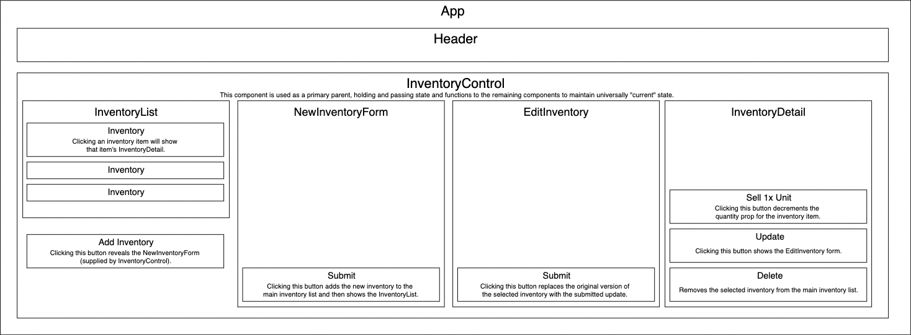

# Inventory Tracker

By _**Kyle Chinick**_

## Description

This app tracks user inventory of products.

A user can create a new product via a form, can change that product via a seperate form (that makes use of the new product form template), and can delete a product.

Additionally, users have the ability to sell a single unit of the selected product which causes that product's quantity to decrease by 1 unit. _NOTE: this feature is still in development, the current version of this app will reflect the quantity decrease only in the console._

---

## Technologies Used

- _HTML / CSS_
- _Node_
- _React_
- _JavaScript / JSX_

---

## Setup/Installation Requirements

1. Clone this repository to your desktop by executing `git clone https://github.com/kylechinick/inventory-tracker.git` in your preferred terminal application.

2. In the terminal, cd into the project directory then execute `npm install`.

3. Execute `npm run start` to build and then run a development version of the app on your local machine.

---

## Component Diagram

For reference, below is a component diagram intended to clarify the ownership and relationships of each app component.

---

## Known Bugs

- The decrement feature for selling a single unit of inventory functions partially as intended – causing the selected product to decrement but does not add the modified product to a new/current state.
  - This results in being able to see the quantity change in the console only.
  - Also because of not currently having the updated value set to a new state repeatedly clicking the "sell" button will infinitely decrement the inventory item from X to X-1 since without the new state the function repeatedly re-references the original quantity to decrement).
